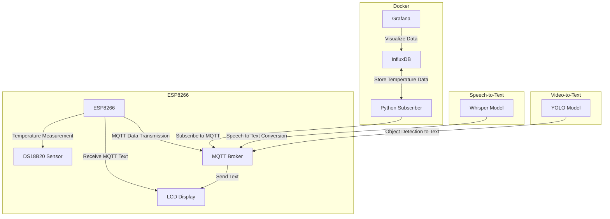

# Speech-to-Text and Video-to-Text Application with Temperature Measurement and Visualization in Grafana

## Project Description

This project demonstrates the integration of IoT technologies, machine learning, and data visualization to create an intelligent system. The key functionalities include:

1. **Temperature Measurement**  
   - The ESP8266 microcontroller measures the ambient temperature using a DS18B20 sensor.
   - The measured temperature is displayed in the Arduino IDE terminal and sent to a remote MQTT broker with encryption and user authentication.

2. **Speech-to-Text Conversion**  
   - A Python program utilizes the Whisper model to convert Polish speech into text.
   - The transcribed text is sent to the MQTT broker for further processing.

3. **Video-to-Text Conversion**  
   - Another Python program uses the YOLO model to detect objects in video frames, name them, and send the descriptions to the MQTT broker.

4. **Displaying Text on an LCD**  
   - ESP8266 receives the transcribed text (speech and video) from the MQTT broker.
   - The text is displayed on a connected LCD screen:
     - **Upper Line**: Displays text from the Speech-to-Text module.
     - **Lower Line**: Displays text from the Video-to-Text module.

5. **Data Collection and Visualization**  
   - Temperature data is saved into an InfluxDB database by a Python subscriber application.
   - Grafana visualizes the temperature data in real-time through customizable dashboards.

---

## System Architecture



---

## Folder Structure

```
project/
├── esp8266/
│   ├── esp8266.ino
│   └── libraries/
├── subscriber/
│   ├── Dockerfile
│   ├── requirements.txt
│   └── subscriber.py
├── speech-to-text/
│   ├── speech_to_text.py
│   ├── requirements.txt
│   └── model/
├── video-to-text/
│   ├── video_to_text.py
│   ├── requirements.txt
│   └── model/
├── docker-compose.yml
├── README.md
└── docs/
    ├── architecture_diagram.md
    ├── installation_guide.md
    └── usage_guide.md
```

### Folder Descriptions

- **esp8266/**: Contains Arduino code for the ESP8266 microcontroller and required libraries.
- **subscriber/**: Python script that subscribes to MQTT and saves temperature data to InfluxDB. Includes a Dockerfile.
- **speech-to-text/**: Program for converting speech to text using the Whisper model.
- **video-to-text/**: Program for detecting objects in video using YOLO and converting the results to text.
- **docker-compose.yml**: Docker Compose file to run all containers for InfluxDB, Grafana, and Subscriber.
- **README.md**: Comprehensive documentation of the project.
- **docs/**: Additional documentation files, including architecture diagrams, installation guides, and usage instructions.

---

## Installation Guide

Follow these steps to set up and run the project. This guide assumes basic familiarity with Docker, Python, and ESP8266.

### Prerequisites

- **Hardware**:
  - ESP8266 microcontroller
  - DS18B20 temperature sensor
  - LCD display
- **Software**:
  - Arduino IDE
  - Python (v3.8+)
  - Docker and Docker Compose
  - Git
- **Accounts**:
  - Grafana and MQTT broker account (if using a cloud-based setup)

---

### Step 1: Clone the Repository

1. Open a terminal and clone the project repository:
   ```bash
   git clone https://github.com/your-repo-name/project.git
   cd project
   ```

---

### Step 2: Set Up Docker Containers

1. Create a `docker-compose.yml` file to run the following services:
   - **InfluxDB**: Database for temperature data.
   - **Grafana**: Dashboard for data visualization.
   - **Subscriber**: Python script subscribing to MQTT and saving data.

   Example `docker-compose.yml` file:
   ```yaml
   version: "3.8"
   services:
     influxdb:
       image: influxdb:latest
       ports:
         - "8086:8086"
       volumes:
         - influxdb-data:/var/lib/influxdb
       environment:
         INFLUXDB_DB: temperature
         INFLUXDB_ADMIN_USER: admin
         INFLUXDB_ADMIN_PASSWORD: password
       networks:
         - monitoring

     grafana:
       image: grafana/grafana:latest
       ports:
         - "3000:3000"
       environment:
         - GF_SECURITY_ADMIN_USER=admin
         - GF_SECURITY_ADMIN_PASSWORD=password
       volumes:
         - grafana-data:/var/lib/grafana
       networks:
         - monitoring

     subscriber:
       build: ./subscriber
       command: python3 subscriber.py
       networks:
         - monitoring

   volumes:
     influxdb-data:
     grafana-data:

   networks:
     monitoring:
       driver: bridge
   ```

2. Start the containers:
   ```bash
   docker-compose up -d
   ```

---

### Step 3: Flash ESP8266 Firmware

1. Open `esp8266.ino` in Arduino IDE.
2. Install the required libraries:
   - OneWire
   - DallasTemperature
   - PubSubClient
3. Update the MQTT broker credentials and WiFi settings in the code.
4. Flash the code to the ESP8266.

---

### Step 4: Install Python Dependencies

1. Set up a virtual environment:
   ```bash
   python3 -m venv venv
   source venv/bin/activate
   ```
2. Install required packages:
   ```bash
   pip install -r requirements.txt
   ```

---

### Step 5: Run Speech-to-Text and Video-to-Text Programs

1. Navigate to the respective folders:
   - **Speech-to-Text**:
     ```bash
     cd speech-to-text
     python speech_to_text.py
     ```
   - **Video-to-Text**:
     ```bash
     cd video-to-text
     python video_to_text.py
     ```

---

### Step 6: Configure Grafana

1. Open Grafana in your browser at `http://localhost:3000`.
2. Add InfluxDB as a data source:
   - URL: `http://influxdb:8086`
   - Database: `temperature`
   - Authentication: Use the credentials set in `docker-compose.yml`.
3. Create a dashboard to visualize the temperature data.

---

## Usage

1. Power the ESP8266 and connect it to WiFi.
2. Speak into the microphone for Speech-to-Text.
3. Use the video feed for Video-to-Text.
4. View results on the LCD or Grafana dashboard.

---

## Authors

- **Wiktor Twardowski**
- **Łukasz Tuliszkiewicz**

## Troubleshooting

- Ensure all Docker containers are running:
  ```bash
  docker ps
  ```
- Verify MQTT broker connection.
- Check for hardware connections on ESP8266.
- Review logs for errors:
  ```bash
  docker-compose logs
  ```

---

If you need further assistance, please refer to the documentation files in the repository or contact the authors.
